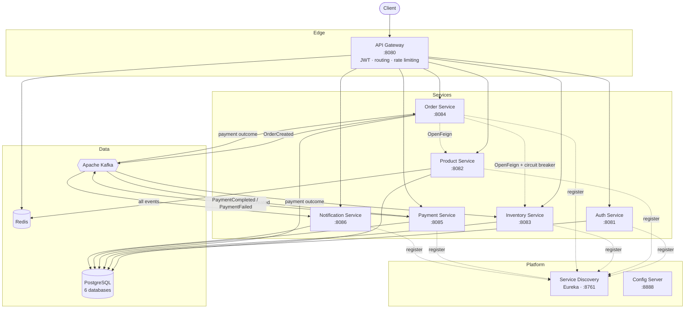
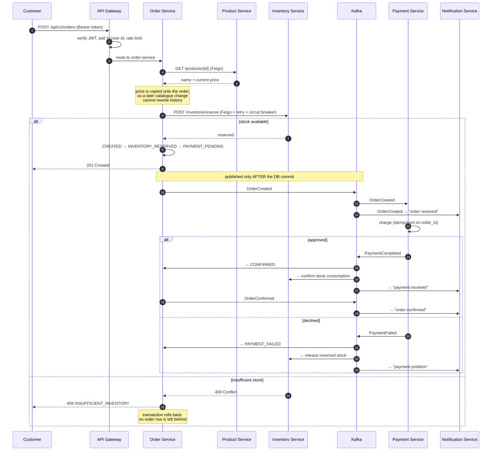
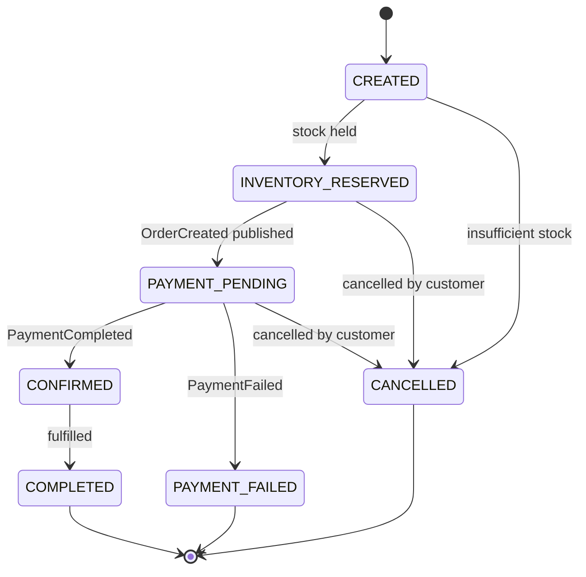

# Enterprise Order Management & E-Commerce Microservices Platform

[](https://github.com/rahulray281528-star/enterprise-order-platform/actions/workflows/ci.yml)
[](https://openjdk.org/projects/jdk/21/)
[](https://spring.io/projects/spring-boot)
[](LICENSE)

A production-style backend platform built with Java 21, Spring Boot 3 and a genuine
microservices architecture: nine services, database-per-service, Kafka for asynchronous
communication, Redis for caching, and the resilience and observability plumbing that a
real system needs.

**Everything runs locally with one command.** No AWS account, no paid services, no
credentials of your own.

---

## Table of contents

- [What this system does](#what-this-system-does)
- [Architecture](#architecture)
- [Technology stack](#technology-stack)
- [Quick start](#quick-start)
- [Prerequisites in detail](#prerequisites-in-detail)
- [Service map](#service-map)
- [Walkthrough: place an order end to end](#walkthrough-place-an-order-end-to-end)
- [Demonstrating the failure path](#demonstrating-the-failure-path)
- [API documentation](#api-documentation)
- [Kafka event flow](#kafka-event-flow)
- [Redis caching strategy](#redis-caching-strategy)
- [Security](#security)
- [Database design](#database-design)
- [Resilience](#resilience)
- [Observability](#observability)
- [Running the tests](#running-the-tests)
- [Project structure](#project-structure)
- [Environment variables](#environment-variables)
- [Kubernetes](#kubernetes)
- [Jenkins CI/CD](#jenkins-cicd)
- [AWS deployment architecture](#aws-deployment-architecture)
- [Troubleshooting](#troubleshooting)
- [Design decisions and trade-offs](#design-decisions-and-trade-offs)
- [Interview discussion points](#interview-discussion-points)
- [Future enhancements](#future-enhancements)
- [AI-assisted development](#ai-assisted-development)

---

## What this system does

A customer registers, browses a catalogue, and places an order. The platform then:

1. prices the order from the live catalogue,
2. reserves stock **synchronously** so the customer gets an immediate yes or no,
3. publishes `OrderCreated` to Kafka,
4. charges the customer asynchronously,
5. confirms the order — or, if payment fails, **releases the reserved stock automatically**,
6. notifies the customer at every step.

The interesting part is step 5. There is no distributed transaction here: the order row
and the inventory row live in different databases owned by different services. The system
uses a **saga with compensating actions** instead, and the code is written so that every
step is idempotent, because Kafka delivers at-least-once.

---

## Architecture



### Order creation flow



### Order state machine



---

## Technology stack

| Area | Technology |
|---|---|
| Language | Java 21 |
| Framework | Spring Boot 3.2, Spring MVC, Spring WebFlux (gateway) |
| Microservices | Spring Cloud 2023.0.1, Eureka, Spring Cloud Gateway, Config Server, OpenFeign |
| Persistence | PostgreSQL 16, Spring Data JPA, Hibernate, Liquibase |
| Messaging | Apache Kafka 3.7 (KRaft — no ZooKeeper) |
| Caching | Redis 7 |
| Security | Spring Security, JWT (HS256), BCrypt, role-based authorization |
| Resilience | Resilience4j — circuit breaker, retry, time limiter, fallback |
| Observability | Spring Boot Actuator, correlation ids, structured logging, Micrometer |
| API docs | springdoc-openapi (Swagger UI) |
| Testing | JUnit 5, Mockito, AssertJ, Spring Boot Test, Testcontainers |
| Quality | JaCoCo, Checkstyle, SpotBugs, SonarQube-compatible |
| Build | Maven (multi-module) |
| Containers | Docker, Docker Compose, Kubernetes manifests |
| CI/CD | GitHub Actions, Jenkins pipeline |

---

## Quick start

```bash
git clone https://github.com/rahulray281528-star/enterprise-order-platform.git
cd enterprise-order-platform

cp .env.example .env          # optional — every value has a working default

docker compose up --build
```

First build takes 5–10 minutes (Maven downloads dependencies once). Subsequent starts
take about a minute.

When it's up:

| What | URL |
|---|---|
| API Gateway | http://localhost:8080 |
| Eureka dashboard | http://localhost:8761 |
| Swagger UI (auth) | http://localhost:8081/swagger-ui.html |
| Swagger UI (products) | http://localhost:8082/swagger-ui.html |
| Swagger UI (orders) | http://localhost:8084/swagger-ui.html |
| Health check | http://localhost:8080/actuator/health |

Watch everything come up:

```bash
docker compose ps
docker compose logs -f order-service
```

Shut down:

```bash
docker compose down          # keep data
docker compose down -v       # also wipe the databases
```

### Seeded demo accounts

| Username | Password | Role |
|---|---|---|
| `admin` | `Admin@123` | ADMIN |
| `customer` | `Customer@123` | CUSTOMER |

These are development-only accounts created by a `CommandLineRunner` that is disabled
outside the local and docker profiles. The catalogue is seeded with six products and
matching stock.

---

## Prerequisites in detail

**To run with Docker (recommended — this is all you need):**

| Software | Minimum version | Check | Where to get it |
|---|---|---|---|
| Docker Engine | 24+ | `docker --version` | https://docs.docker.com/get-docker/ |
| Docker Compose | v2 | `docker compose version` | bundled with Docker Desktop |

That's it. Java and Maven are **not** required — they run inside the build container.

**Resources:** give Docker at least **6 GB of RAM** and 4 CPUs. Twelve containers
(9 services + PostgreSQL + Redis + Kafka) will not fit comfortably in the 2 GB default
on Docker Desktop. Settings → Resources → Memory.

**Ports that must be free:** 5432, 6379, 8080, 8081, 8082, 8083, 8084, 8085, 8086,
8761, 8888, 9092. Change any of them in `.env` if something already uses them.

**To build or develop outside Docker, additionally:**

| Software | Version | Check |
|---|---|---|
| JDK | 21 | `java -version` |
| Maven | 3.9+ | `mvn -version` |

```bash
mvn clean install          # build everything
mvn clean verify           # build + unit tests + integration tests + coverage
mvn clean verify -Pquality # also run Checkstyle and SpotBugs
```

Then start infrastructure only and run services from your IDE:

```bash
docker compose up postgres redis kafka
```

---

## Service map

| Service | Port | Database | Responsibility |
|---|---|---|---|
| service-discovery | 8761 | — | Eureka registry; every service registers here |
| config-server | 8888 | — | Centralised configuration (native/classpath backend) |
| api-gateway | 8080 | — | Single entry point: routing, JWT enforcement, rate limiting, correlation ids |
| auth-service | 8081 | `auth_db` | Registration, login, JWT issuing, BCrypt password hashing |
| product-service | 8082 | `product_db` | Catalogue CRUD, search/filter/pagination, Redis caching |
| inventory-service | 8083 | `inventory_db` | Stock levels, reservations, releases, audit trail |
| order-service | 8084 | `order_db` | Order lifecycle, saga orchestration, status history |
| payment-service | 8085 | `payment_db` | Payment processing, idempotent charging |
| notification-service | 8086 | `notification_db` | Consumes every event, records customer notifications |

Each service owns its schema. No service reads another's tables — the only ways across a
boundary are a REST call or a Kafka event.

---

## Walkthrough: place an order end to end

Copy-paste these in order. All traffic goes through the gateway on port 8080.

### 1. Log in

```bash
TOKEN=$(curl -s -X POST http://localhost:8080/api/v1/auth/login \
  -H 'Content-Type: application/json' \
  -d '{"username":"customer","password":"Customer@123"}' \
  | python3 -c 'import sys,json; print(json.load(sys.stdin)["data"]["accessToken"])')

echo "$TOKEN"
```

### 2. Browse the catalogue

```bash
curl -s "http://localhost:8080/api/v1/products?page=0&size=5&sortBy=price&sortDir=asc" \
  | python3 -m json.tool
```

Fetch one product twice and watch the second call skip the database — the log line
`Cache miss for product ...` appears only on the first:

```bash
curl -s http://localhost:8080/api/v1/products/p0000000-0000-0000-0000-000000000002 | python3 -m json.tool
curl -s http://localhost:8080/api/v1/products/p0000000-0000-0000-0000-000000000002 | python3 -m json.tool
docker compose logs product-service | grep "Cache miss"
```

### 3. Check stock

```bash
curl -s -H "Authorization: Bearer $TOKEN" \
  http://localhost:8080/api/v1/inventory/p0000000-0000-0000-0000-000000000002 | python3 -m json.tool
```

### 4. Place the order

```bash
curl -s -X POST http://localhost:8080/api/v1/orders \
  -H "Authorization: Bearer $TOKEN" \
  -H 'Content-Type: application/json' \
  -d '{"items":[{"productId":"p0000000-0000-0000-0000-000000000002","quantity":2}]}' \
  | python3 -m json.tool
```

You get `201 Created` with status `PAYMENT_PENDING`. Payment happens asynchronously.

### 5. Watch it confirm

```bash
ORDER_ID=<id from the previous response>

sleep 3
curl -s -H "Authorization: Bearer $TOKEN" \
  http://localhost:8080/api/v1/orders/$ORDER_ID | python3 -m json.tool
```

Status is now `CONFIRMED` and `paymentId` is populated — set by the Kafka consumer, not
by your request.

### 6. See the notifications the events produced

```bash
CUSTOMER_ID=<customerId from the order response>

curl -s -H "Authorization: Bearer $TOKEN" \
  http://localhost:8080/api/v1/notifications/customer/$CUSTOMER_ID | python3 -m json.tool
```

Three notifications: order received, payment received, order confirmed. The notification
service was never called by anyone — it only listened.

---

## Demonstrating the failure path

This is the part worth showing an interviewer. The simulated gateway declines any order
at or above ₹200,000 (`PAYMENT_DECLINE_AT_OR_ABOVE`), so ordering three laptops at
₹74,999 each (₹224,997) triggers a decline.

```bash
# stock before
curl -s -H "Authorization: Bearer $TOKEN" \
  http://localhost:8080/api/v1/inventory/p0000000-0000-0000-0000-000000000001

# order 3 laptops — reserved successfully, then declined at payment
curl -s -X POST http://localhost:8080/api/v1/orders \
  -H "Authorization: Bearer $TOKEN" -H 'Content-Type: application/json' \
  -d '{"items":[{"productId":"p0000000-0000-0000-0000-000000000001","quantity":3}]}'

sleep 4

# stock after — back to where it started, released automatically
curl -s -H "Authorization: Bearer $TOKEN" \
  http://localhost:8080/api/v1/inventory/p0000000-0000-0000-0000-000000000001
```

The order ends in `PAYMENT_FAILED` with a `failureReason`, and the reserved stock has
been returned. Nobody orchestrated that: `payment-service` published `PaymentFailed`, and
`inventory-service` and `order-service` each reacted independently.

**Out-of-stock path.** `SKU-BOOK-001` is seeded with only 3 units:

```bash
curl -s -X POST http://localhost:8080/api/v1/orders \
  -H "Authorization: Bearer $TOKEN" -H 'Content-Type: application/json' \
  -d '{"items":[{"productId":"p0000000-0000-0000-0000-000000000006","quantity":10}]}'
```

Returns `409` with error `INSUFFICIENT_INVENTORY`. No order row is created — the
reservation failure rolls the whole transaction back.

---

## API documentation

Swagger UI per service, with a working **Authorize** button (paste the raw token, no
`Bearer ` prefix):

- Auth — http://localhost:8081/swagger-ui.html
- Products — http://localhost:8082/swagger-ui.html
- Inventory — http://localhost:8083/swagger-ui.html
- Orders — http://localhost:8084/swagger-ui.html
- Payments — http://localhost:8085/swagger-ui.html
- Notifications — http://localhost:8086/swagger-ui.html

### Endpoints

| Method | Path | Auth | Description |
|---|---|---|---|
| POST | `/api/v1/auth/register` | — | Create an account |
| POST | `/api/v1/auth/login` | — | Get an access + refresh token |
| POST | `/api/v1/auth/validate` | — | Check a token |
| GET | `/api/v1/auth/users/{id}` | ADMIN | Fetch a user |
| GET | `/api/v1/products` | — | List with pagination, sorting, filtering |
| GET | `/api/v1/products/{id}` | — | One product (Redis cached) |
| GET | `/api/v1/products/sku/{sku}` | — | Look up by SKU |
| POST | `/api/v1/products` | ADMIN | Create |
| PUT | `/api/v1/products/{id}` | ADMIN | Update (evicts the cache entry) |
| DELETE | `/api/v1/products/{id}` | ADMIN | Deactivate (soft delete) |
| GET | `/api/v1/categories` | — | List categories |
| POST | `/api/v1/categories` | ADMIN | Create a category |
| GET | `/api/v1/inventory/{productId}` | any | Current stock |
| POST | `/api/v1/inventory/reserve` | any | Reserve (idempotent per order) |
| POST | `/api/v1/inventory/release` | any | Release a reservation |
| POST | `/api/v1/inventory/restock` | ADMIN | Add stock |
| POST | `/api/v1/orders` | any | Place an order |
| GET | `/api/v1/orders/{id}` | owner/ADMIN | One order |
| GET | `/api/v1/orders/customer/{id}` | owner/ADMIN | A customer's orders |
| PUT | `/api/v1/orders/{id}/cancel` | owner/ADMIN | Cancel |
| POST | `/api/v1/payments` | ADMIN | Manually initiate |
| GET | `/api/v1/payments/{id}` | any | One payment |
| GET | `/api/v1/payments/order/{orderId}` | any | Payment for an order |
| GET | `/api/v1/notifications/customer/{id}` | owner/ADMIN | Notification history |

### Response envelopes

Success:

```json
{
  "success": true,
  "message": "Order placed",
  "data": { "id": "…", "status": "PAYMENT_PENDING" },
  "timestamp": "2026-09-06T10:15:30Z",
  "traceId": "8f14e45f-ceea-467a-9f2a-1a2b3c4d5e6f"
}
```

Error — never contains a stack trace:

```json
{
  "timestamp": "2026-09-06T10:15:30Z",
  "status": 409,
  "error": "INSUFFICIENT_INVENTORY",
  "message": "Insufficient inventory for product p000…006: requested 10, available 3",
  "path": "/api/v1/orders",
  "traceId": "8f14e45f-ceea-467a-9f2a-1a2b3c4d5e6f"
}
```

The `traceId` is the correlation id, and it appears in every log line across every
service for that request.

---

## Kafka event flow

| Topic | Produced by | Consumed by |
|---|---|---|
| `order-created` | order-service | payment-service, notification-service |
| `payment-completed` | payment-service | order-service, inventory-service, notification-service |
| `payment-failed` | payment-service | order-service, inventory-service, notification-service |
| `order-confirmed` | order-service | notification-service |
| `order-cancelled` | order-service | inventory-service, notification-service |
| `inventory-reserved` | inventory-service | notification-service |
| `*.DLT` | error handler | — (manual inspection) |

Every topic has 3 partitions, and the **order id is the partition key**, so all events
for one order land on the same partition and are processed in order.

**Delivery guarantees.** Producers use `acks=all` with idempotence enabled. Consumers
disable auto-commit and commit per record. Delivery is at-least-once, so every consumer
is written to be idempotent — see [Design decisions](#design-decisions-and-trade-offs).

**Poison messages.** A consumer failure is retried 3 times, one second apart, then the
record is published to `<topic>.DLT` and the offset is committed, so one bad message
cannot block a partition forever.

Inspect the topics:

```bash
docker compose exec kafka kafka-topics.sh --bootstrap-server localhost:29092 --list

docker compose exec kafka kafka-console-consumer.sh \
  --bootstrap-server localhost:29092 --topic order-created --from-beginning
```

---

## Redis caching strategy

Applied to the read-heavy part of the system: the product catalogue.

- `GET /api/v1/products/{id}` is annotated `@Cacheable`. First call hits PostgreSQL,
  later calls are served from Redis.
- TTL is **10 minutes**.
- `PUT` and `DELETE` are annotated `@CacheEvict` for that key, so a price change is
  visible on the very next read rather than up to 10 minutes later. Correctness comes
  from the eviction; the TTL is only a backstop.
- Values are stored as **JSON**, not Java serialization, so the cache is readable with
  `redis-cli` and survives changes to the DTO.
- Null values are not cached, so a miss for a non-existent product cannot be poisoned
  into a permanent 404.

Only the response DTO is cached, never the JPA entity — caching a managed entity leaks
Hibernate proxies and lazy-loading state into the cache.

```bash
docker compose exec redis redis-cli KEYS 'products*'
docker compose exec redis redis-cli GET 'products::p0000000-0000-0000-0000-000000000002'
```

---

## Security

- **JWT (HS256)** with separate access (1 h) and refresh (24 h) tokens. Tokens carry a
  `type` claim so a refresh token cannot be used as an access token.
- **BCrypt** password hashing. Plain-text passwords are never stored or logged.
- **Role-based authorization** — `CUSTOMER` and `ADMIN` — enforced with
  `@PreAuthorize` and URL rules.
- **Defence in depth.** The gateway rejects bad tokens at the edge *and* each service
  verifies the token itself, so a service reached directly inside the cluster is still
  protected.
- **Ownership checks.** A customer can only read and cancel their own orders; the check
  is in the service layer, not just the controller.
- **No account enumeration.** A wrong password and an unknown username return the exact
  same error.
- **No secrets in source.** `jwt.secret` comes from `JWT_SECRET`; the service refuses to
  start if it is missing or shorter than 32 bytes. `.env` is gitignored.
- **Stateless.** No sessions, so CSRF protection is disabled deliberately rather than
  by accident.

> The default `JWT_SECRET` in `.env.example` is a **development value that is committed
> on purpose** so the project runs on clone. Generate a real one for anything else:
> `openssl rand -base64 48`.

---

## Database design

Six logically separate databases on one PostgreSQL instance (in production these would
be separate instances). Schema is owned entirely by **Liquibase**; Hibernate runs with
`ddl-auto: validate` and will refuse to start if an entity and its table disagree.

| Database | Tables |
|---|---|
| `auth_db` | `users` |
| `product_db` | `categories`, `products` |
| `inventory_db` | `inventory`, `inventory_transactions` |
| `order_db` | `orders`, `order_items`, `order_status_history`, `processed_events` |
| `payment_db` | `payments` |
| `notification_db` | `notifications` |

Notable choices:

- **Optimistic locking** (`@Version`) on every mutable aggregate.
- **Pessimistic locking** (`SELECT … FOR UPDATE`) on the inventory reserve path only,
  where two concurrent orders for the last unit would otherwise both succeed.
- **Check constraints** enforce invariants at the database level — stock can never go
  negative, an order total can never be negative — so a future bug in application code
  still cannot corrupt the data.
- **`payments.order_id` is UNIQUE**: this is the idempotency key that makes charging a
  customer twice impossible, enforced by the database rather than by application logic.
- **Historic prices are copied** onto `order_items`, not referenced, so a catalogue price
  change cannot rewrite what a customer agreed to pay.

Full detail, including the ER diagram: [`docs/database-design.md`](docs/database-design.md).

---

## Resilience

`order-service → inventory-service` is the one place where a synchronous call sits on
the critical path, so it is the one place that needs protection.

| Pattern | Setting | Why |
|---|---|---|
| Retry | 3 attempts, exponential backoff from 500 ms | Absorbs a transient blip or a rolling restart |
| Circuit breaker | opens above 50% failures over 10 calls, half-opens after 10 s | Stops hammering a dependency that is genuinely down |
| Time limiter | 4 s | A slow dependency must not hold order-service threads |
| Fallback | fails fast with `503 SERVICE_UNAVAILABLE` | **Deliberately does not fake success** |

That last row is the important one. A fallback that returned "reserved" when inventory
was unreachable would let an order proceed to payment for stock that was never held.
When the truth is unknown, the honest answer is an error.

```bash
# Watch the breaker open
docker compose stop inventory-service
curl -s -X POST http://localhost:8080/api/v1/orders \
  -H "Authorization: Bearer $TOKEN" -H 'Content-Type: application/json' \
  -d '{"items":[{"productId":"p0000000-0000-0000-0000-000000000002","quantity":1}]}'
# → 503 SERVICE_UNAVAILABLE
docker compose start inventory-service
```

---

## Observability

- **Health** — `/actuator/health` on every service, with Kubernetes liveness and
  readiness probes at `/actuator/health/liveness` and `/actuator/health/readiness`.
- **Metrics** — `/actuator/metrics` and `/actuator/prometheus`.
- **Correlation ids** — the gateway stamps `X-Correlation-Id` on every request; each
  service puts it in the SLF4J MDC and echoes it on the response. Every log line carries
  it, so one customer action is greppable across all nine services.
- **Structured logs** — each line is prefixed with the service name and correlation id.

```bash
curl -s http://localhost:8084/actuator/health | python3 -m json.tool

# follow one request across the whole platform
docker compose logs | grep "8f14e45f-ceea-467a-9f2a-1a2b3c4d5e6f"
```

---

## Running the tests

```bash
mvn test                      # unit tests (fast, no Docker needed)
mvn verify                    # unit + integration (Testcontainers — needs Docker)
mvn verify -Pquality          # + Checkstyle and SpotBugs
```

Coverage reports land in `*/target/site/jacoco/index.html`.

Unit tests cover the business logic that actually matters: reservation and release
idempotency, insufficient-stock rejection, order pricing and totals, cancellation rules,
payment approval and decline, and the fact that a wrong password and an unknown user are
indistinguishable. Integration tests (`*IT`) run against a real PostgreSQL started by
Testcontainers with the real Liquibase migrations applied.

Tests were written for the paths where a bug would be expensive, not to inflate a
coverage number.

---

## Project structure

```
enterprise-order-platform/
├── common/                     shared DTOs, exceptions, events, JWT security, tracing
├── service-discovery/          Eureka server
├── config-server/              Spring Cloud Config Server
├── api-gateway/                Spring Cloud Gateway (reactive)
├── auth-service/
├── product-service/
├── inventory-service/
├── order-service/
├── payment-service/
├── notification-service/
├── docker/                     PostgreSQL multi-database init script
├── kubernetes/                 namespace, configmaps, secrets, deployments, ingress
├── jenkins/                    Jenkinsfile + pipeline documentation
├── docs/                       system design, database design, interview guide, AWS
├── .github/workflows/ci.yml    GitHub Actions build
├── docker-compose.yml
├── .env.example
└── pom.xml                     parent POM, dependency management
```

Every service follows the same internal layout: `controller` → `service` → `repository`,
with `dto`, `entity`, `config` and (where relevant) `client` and `messaging`.

---

## Environment variables

Every variable has a working default. Copy `.env.example` to `.env` to change any.

| Variable | Default | Purpose |
|---|---|---|
| `POSTGRES_USER` | `postgres` | Database user |
| `POSTGRES_PASSWORD` | `postgres` | Database password |
| `POSTGRES_PORT` | `5432` | Host port for PostgreSQL |
| `REDIS_PORT` | `6379` | Host port for Redis |
| `KAFKA_PORT` | `9092` | Host port for Kafka |
| `JWT_SECRET` | dev value | **Min 32 chars.** Signing key |
| `JWT_EXPIRATION` | `3600000` | Access token TTL (ms) |
| `JWT_REFRESH_EXPIRATION` | `86400000` | Refresh token TTL (ms) |
| `PAYMENT_DECLINE_AT_OR_ABOVE` | `200000.00` | Simulated gateway decline threshold |
| `PAYMENT_GATEWAY_LATENCY_MS` | `250` | Simulated gateway latency |
| `LOGGING_LEVEL_ROOT` | `INFO` | Root log level |
| `LOGGING_LEVEL_APP` | `DEBUG` | `com.enterprise` log level |

---

## Kubernetes

Manifests for a local cluster (Minikube or Kind) are in [`kubernetes/`](kubernetes/),
with instructions in [`kubernetes/README.md`](kubernetes/README.md).

Kubernetes is **not** required for local development — Docker Compose is the supported
path. The manifests exist to show how the platform would be deployed.

---

## Jenkins CI/CD

[`jenkins/Jenkinsfile`](jenkins/Jenkinsfile) defines: Checkout → Compile → Unit tests →
Integration tests → Checkstyle + SpotBugs (parallel) → JaCoCo → SonarQube (optional) →
Package → Docker build → Image validation.

No Jenkins server is needed to work on this project. The equivalent pipeline that
actually runs on every push is [`.github/workflows/ci.yml`](.github/workflows/ci.yml) —
that's what the badge at the top of this file reports.

---

## AWS deployment architecture

[`docs/aws-architecture.md`](docs/aws-architecture.md) documents how this would be
deployed on AWS — EKS, RDS, MSK, ElastiCache, S3, CloudWatch, IAM, VPC layout.

**This is deployment documentation, not a description of a running system.** Nothing in
this repository is deployed to AWS, and nothing requires an AWS account.

---

## Troubleshooting

**Services restart in a loop on first start.**
Usually memory. Give Docker at least 6 GB (Docker Desktop → Settings → Resources).
Check with `docker stats` — an exit code 137 means out-of-memory.

**`port is already allocated`.**
Something already uses one of the ports. Find it with `lsof -i :8080`
(`netstat -ano | findstr :8080` on Windows), or change the port in `.env`.

**`Connection refused` to PostgreSQL / Kafka on startup.**
Expected for the first ~60 seconds. Services depend on healthchecks and Spring retries.
If it persists past two minutes: `docker compose logs postgres kafka`.

**Kafka consumers idle, nothing being processed.**
```bash
docker compose exec kafka kafka-topics.sh --bootstrap-server localhost:29092 --list
docker compose exec kafka kafka-consumer-groups.sh --bootstrap-server localhost:29092 --describe --all-groups
```
A growing `LAG` means the consumer is down; check that service's logs.

**`401 Unauthorized` on every call.**
The token expired (1 hour) or `JWT_SECRET` differs between services. All services must
share one secret — compose passes the same value to all of them.

**Liquibase checksum error after editing a migration.**
Never edit an applied changeset; add a new one. To reset locally:
`docker compose down -v && docker compose up --build`.

**Build fails with `Could not resolve dependencies`.**
Network or proxy issue reaching Maven Central. Retry, or `mvn -U clean install`.

**Everything is broken, start clean.**
```bash
docker compose down -v
docker system prune -af --volumes   # WARNING: removes all unused Docker data
docker compose up --build
```

---

## Design decisions and trade-offs

**Saga, not two-phase commit.** Order and inventory live in different databases owned by
different services. A distributed transaction would couple them and hold locks across a
network call. The saga trades atomicity for availability: there is a window where an
order is `PAYMENT_PENDING` while stock is already held. That window is bounded and every
step has a compensating action.

**Reservation is synchronous, everything after it is not.** The customer needs an
immediate yes or no on availability, so that call is a blocking Feign call with a
circuit breaker. Payment can take seconds, so it is event-driven — the customer is not
kept waiting on a payment provider.

**Kafka publish is deferred until after commit.** Publishing inside a transaction is a
dual-write bug: the broker would see `OrderCreated` even for a transaction that later
rolls back, and payment would charge for an order that does not exist. Publishing from
`@TransactionalEventListener(AFTER_COMMIT)` closes that. The remaining gap — commit
succeeds, broker unreachable — needs a transactional outbox, which is the honest next
step and is not implemented here.

**Idempotency is enforced three different ways**, chosen per situation:
- `payments.order_id UNIQUE` — a database constraint, because two concurrent deliveries
  can both pass an application-level "does it exist?" check but only one can insert.
- `processed_events` table in order-service — an explicit ledger keyed by event id.
- Transaction-type checks in inventory-service — the existing audit trail already
  answers "have I already reserved for this order?", so no extra table is needed.

**Pessimistic locking only where it is needed.** `SELECT … FOR UPDATE` serialises
concurrent reservations for the same product, which is the difference between correct
stock and overselling. Everywhere else optimistic `@Version` locking is enough and does
not hold database locks.

**Products are soft-deleted.** Orders reference products historically; a hard delete
would make past orders unreadable.

**The gateway does not depend on `common`.** Common pulls in the servlet stack; the
gateway is reactive WebFlux. Sharing the module would have forced a servlet container
into a reactive service. Duplicating ~40 lines of JWT verification is the cheaper
mistake.

**The payment gateway is simulated, deterministically.** Wiring a real provider would
make cloning this repository depend on third-party credentials. The decline rule is a
threshold rather than a random failure so the README walkthrough and the tests are
repeatable. The boundary is a single class — swapping in a real HTTP client changes
nothing else.

---

## Interview discussion points

Worked answers to 35+ likely questions are in
[`docs/interview-guide.md`](docs/interview-guide.md). The topics this codebase
genuinely supports:

- Why a saga rather than a distributed transaction, and where the consistency window is
- How at-least-once delivery forces idempotency, and three different ways to get it
- Optimistic vs pessimistic locking, and how overselling actually happens
- Why the circuit-breaker fallback fails instead of returning a fake success
- Dual writes, and why the Kafka publish waits for the commit
- Cache invalidation: why eviction on write, not just a TTL
- Database-per-service: what it costs, and what a join across services looks like instead
- Deadlock avoidance through deterministic lock ordering
- Why the gateway and the services both verify the JWT
- What a transactional outbox would add, and why it isn't here yet

---

## Future enhancements

- **Transactional outbox** for guaranteed event publication
- **Distributed tracing** with OpenTelemetry and Jaeger (correlation ids are in place;
  spans are not)
- **Refresh token rotation** with server-side revocation
- **API versioning** beyond the `/v1` prefix, with a deprecation policy
- **Read models** (CQRS) for order history, to stop paging over the write model
- **Saga timeout handling** — an order stuck in `PAYMENT_PENDING` because a payment event
  was never received
- **Grafana dashboards** over the Prometheus metrics already exposed
- **Contract testing** (Pact) between services

---

## AI-assisted development

AI tools were used as development assistants on this project — for code generation,
refactoring, unit-test scaffolding, code review, debugging and documentation.

The architecture, the design decisions, and the trade-offs documented above are mine, and
every line was reviewed before it was committed. AI did not independently develop or
verify this system; the build, the tests and the runtime behaviour are what verify it,
and the CI badge at the top of this file reports that verification honestly.

---

## License

MIT — see [LICENSE](LICENSE).
