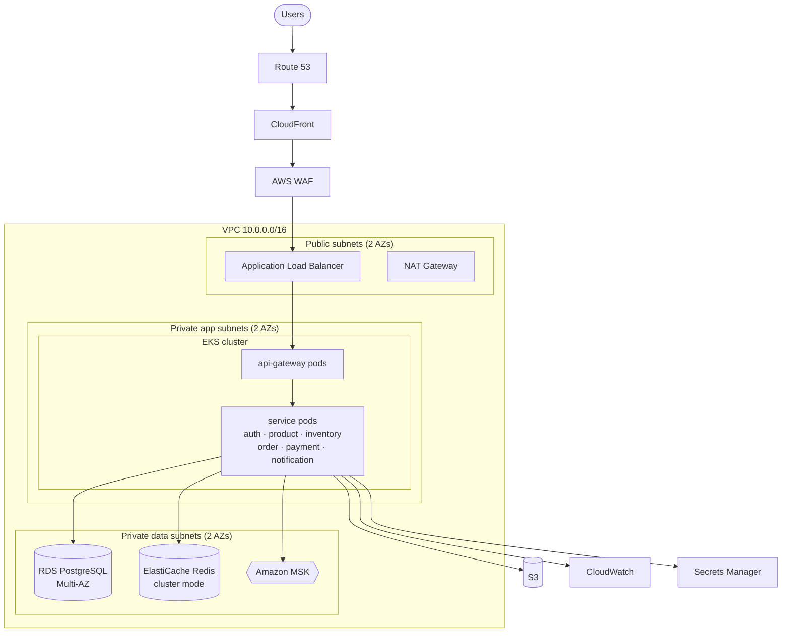

# AWS deployment architecture

> **This is a design document, not a description of a running system.**
> Nothing in this repository is deployed to AWS. The platform runs entirely locally with
> Docker Compose and requires no AWS account. This document describes how it *would* be
> deployed, and is here because that reasoning is part of the design.

## Target architecture

## Service mapping

| Local | AWS | Notes |
|---|---|---|
| Docker Compose | **EKS** | Managed Kubernetes; the manifests in `kubernetes/` are the starting point |
| PostgreSQL container | **RDS PostgreSQL, Multi-AZ** | Automated backups, PITR, synchronous standby |
| Redis container | **ElastiCache for Redis** | Cluster mode for the catalogue cache |
| Kafka container | **Amazon MSK** | Managed Kafka; 3 brokers across AZs |
| Eureka | **EKS Services + CoreDNS** | Kubernetes service discovery replaces Eureka entirely |
| Config Server | **AWS AppConfig** or ConfigMaps | Both are viable; AppConfig adds validated rollouts |
| `.env` / JWT secret | **Secrets Manager** | Injected via the External Secrets Operator; rotation supported |
| Local logs | **CloudWatch Logs** | Structured JSON, correlation id as a searchable field |
| — | **S3** | Product images, invoice PDFs, log archive |
| — | **Lambda** | Scheduled saga-timeout sweeper, report generation |
| — | **DynamoDB** | A natural fit for the notification history — high write volume, key-based reads, no joins |

## Networking

- **VPC** `10.0.0.0/16` across two availability zones.
- **Public subnets** hold only the ALB and NAT gateways.
- **Private app subnets** hold the EKS nodes. No public IPs; egress via NAT.
- **Private data subnets** hold RDS, ElastiCache and MSK, with no route to the internet
  at all.
- **Security groups** are chained rather than CIDR-based: the RDS group accepts 5432
  only from the EKS node group's security group.

## Why these choices

**EKS over ECS.** The workload is already Kubernetes-shaped (the manifests exist),
and portability off AWS matters for a system that runs identically under Compose locally.
ECS would be cheaper to operate for a smaller team, and that is a legitimate counter-argument.

**RDS over self-managed PostgreSQL.** Multi-AZ failover, automated backups and
point-in-time recovery are not worth rebuilding. In production the six logical databases
become separate RDS instances so one service's load cannot starve another — the single
shared instance is a local-development compromise.

**MSK over self-managed Kafka.** Broker patching and rebalancing are undifferentiated
work. MSK Serverless is worth considering for spiky traffic.

**DynamoDB for notifications specifically.** It is the one table with high write volume,
purely key-based access, and no relational queries. Forcing every service onto DynamoDB
would be resume-driven design; using it where the access pattern actually matches is not.

**Lambda for the saga sweeper.** An hourly job that finds orders stuck in
`PAYMENT_PENDING` and compensates them is exactly the shape Lambda suits: short, scheduled,
stateless. Running a whole pod for it would be waste.

## Observability on AWS

- CloudWatch Logs with structured JSON; the correlation id becomes a queryable field, so
  a single Logs Insights query returns every log line for one customer action across all
  services.
- CloudWatch Container Insights for pod and node metrics.
- AWS X-Ray or a managed OpenTelemetry collector for real distributed tracing — the gap
  that correlation ids alone do not fill.
- Alarms on: circuit-breaker open state, Kafka consumer lag, RDS connection saturation,
  and the count of orders older than N minutes still in `PAYMENT_PENDING`.

## Security

- IAM Roles for Service Accounts (IRSA) — each pod assumes only the role it needs.
- Secrets Manager with automatic rotation; nothing sensitive in a manifest or an image.
- Encryption at rest (RDS, S3, MSK, EBS) and in transit (TLS to the ALB, TLS to MSK).
- WAF on CloudFront for common web exploits and IP-based rate limiting ahead of the
  application-level limiter.
- Private subnets with no inbound internet route for anything holding data.

## Cost notes

The largest line items would be EKS control plane + nodes, RDS Multi-AZ, and MSK. For a
portfolio or low-traffic deployment, single-AZ RDS, MSK Serverless and a Fargate-backed
EKS cluster cut cost substantially at the price of availability guarantees — a trade-off
worth stating rather than defaulting past.
