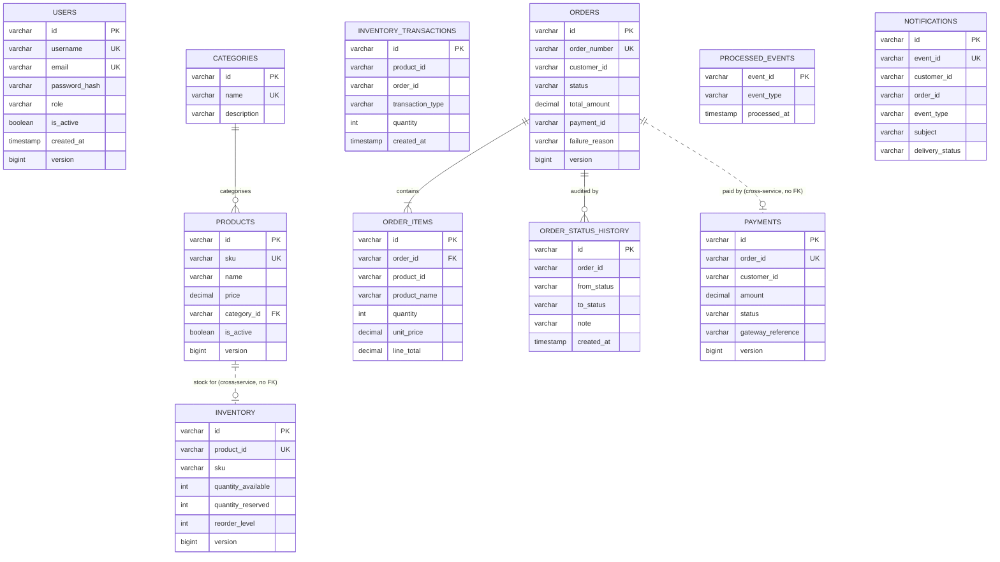

# Database design

Six logically separate databases, one per service. Schema is owned by **Liquibase**;
Hibernate runs with `ddl-auto: validate` and refuses to start if an entity and its table
disagree — so a mapping drift is a boot failure, not a runtime surprise.

## Ownership

| Database | Owner | Tables |
|---|---|---|
| `auth_db` | auth-service | `users` |
| `product_db` | product-service | `categories`, `products` |
| `inventory_db` | inventory-service | `inventory`, `inventory_transactions` |
| `order_db` | order-service | `orders`, `order_items`, `order_status_history`, `processed_events` |
| `payment_db` | payment-service | `payments` |
| `notification_db` | notification-service | `notifications` |

No service reads or writes another service's tables. Cross-service references
(`order_items.product_id`, `inventory.product_id`) are plain columns with **no foreign
key**, because the referenced row lives in a different database. Referential integrity
across that boundary is maintained by the application and by events, not by the engine.

## ER diagram



Solid lines are real foreign keys inside one database. Dotted lines cross a service
boundary and are **not** enforced by the database.

## Indexes, and why each one exists

| Table | Index | Query it serves |
|---|---|---|
| `users` | `idx_users_username` | Login — the hottest lookup in the system |
| `users` | `idx_users_email` | Duplicate-email check on registration |
| `products` | `idx_products_sku` | `GET /products/sku/{sku}` |
| `products` | `idx_products_category` | Category filter on the list endpoint |
| `products` | `idx_products_active` | `activeOnly=true`, the default listing |
| `inventory` | `idx_inventory_product` | Every reserve and release, by product |
| `inventory_transactions` | `idx_inv_tx_order` | Release and confirm: "what did this order reserve?" |
| `orders` | `idx_orders_customer` | "My orders" |
| `orders` | `idx_orders_status` | Operational queries over stuck orders |
| `orders` | `idx_orders_created` | Default sort of the listing is `created_at DESC` |
| `payments` | `idx_payments_order` | `GET /payments/order/{orderId}` |
| `notifications` | `idx_notifications_customer` | Notification history |

Every index above corresponds to an actual query in the code. Indexes are not free —
they cost write throughput and storage — so speculative ones were not added.

## Constraints that carry design intent

| Constraint | Table | Why it exists |
|---|---|---|
| `uk_payments_order` (UNIQUE on `order_id`) | `payments` | **The idempotency guarantee.** Makes double-charging impossible even under concurrent event delivery, at the engine level rather than in application logic |
| `ck_inventory_available_non_negative` | `inventory` | Stock can never go negative, whatever a future bug does |
| `ck_inventory_reserved_non_negative` | `inventory` | Same, for the reserved pool |
| `ck_orders_total_non_negative` | `orders` | An order total is never negative |
| `ck_order_items_quantity_positive` | `order_items` | A line with zero or negative quantity is meaningless |
| `ck_products_price_positive` | `products` | Price is always > 0 |
| `uk_notifications_event` | `notifications` | One notification per source event, even on redelivery |
| `fk_order_items_order` ON DELETE CASCADE | `order_items` | Items have no life without their order |
| `fk_products_category` ON DELETE SET NULL | `products` | Deleting a category must not delete products |

The check constraints are the important ones. Application-level validation can be
bypassed by a bad migration, a manual `UPDATE`, or a bug in a new code path. A check
constraint cannot.

## Locking strategy

| Table | Strategy | Reason |
|---|---|---|
| `inventory` | **Pessimistic** (`SELECT … FOR UPDATE`) on the reserve path | Concurrent orders for the same product would otherwise both read the same availability and oversell |
| `inventory` | Optimistic (`@Version`) on all other paths | Low contention; no reason to hold a lock |
| `orders` | Optimistic (`@Version`) | Two writers to one order are rare |
| `products` | Optimistic (`@Version`) | Admin edits, essentially uncontended |
| `payments` | Optimistic + the UNIQUE constraint | The constraint does the real work |

To avoid deadlocks, the reserve path sorts items by `product_id` before locking, so every
transaction takes locks in the same order.

## Migrations

Each service owns its own changelog under
`src/main/resources/db/changelog/`, applied automatically on startup.

```
db/changelog/
├── changelog-master.xml          includes, in order
└── changes/
    ├── 001-create-…-tables.xml   schema
    └── 002-seed-….xml            demo data (local and docker contexts)
```

Rules:
- **Never edit an applied changeset.** Liquibase stores a checksum; changing the file
  makes every existing environment refuse to start. Add a new changeset instead.
- **Every changeset has a `<rollback>`.**
- **Seed data is separated from schema** so production can apply the schema without the
  demo catalogue.
- Reset locally with `docker compose down -v`.

## Data types

- **`VARCHAR(36)` for ids, holding UUIDs.** UUIDs let a service generate an id without a
  round trip to the database, which matters when the id is needed to build an event
  before the row is committed. The cost against `BIGSERIAL` is size and index locality —
  accepted here for the distributed-friendliness. Postgres's native `uuid` type would be
  the tighter choice in production.
- **`DECIMAL` for money, never `DOUBLE`.** Binary floating point cannot represent 0.10
  exactly; summing order lines in `double` produces cent-level drift that shows up in
  reconciliation. `DECIMAL(14,2)` for totals, `DECIMAL(12,2)` for unit prices.
- **`TIMESTAMP` for audit columns**, set by JPA lifecycle callbacks so they cannot be
  forgotten.
- **Enums stored as `VARCHAR`, not ordinals.** `@Enumerated(EnumType.STRING)`. Ordinals
  break the moment someone reorders the enum, and the stored data is unreadable.
